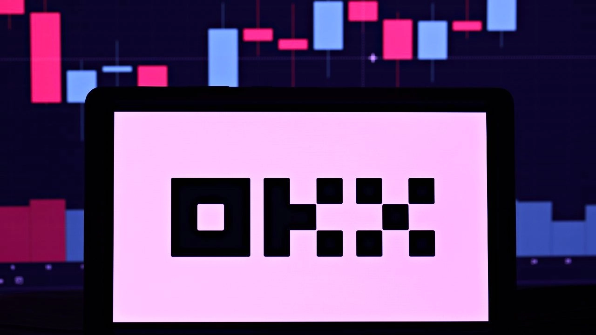

# OKX Launches Its Own Blockchain as Token Soars in Markets

When a major crypto exchange decides to build its own blockchain, you know something interesting is brewing. OKX just dropped their zkEVM roadmap, and the market responded like it just found money in an old jacket pocket—their OKB token jumped over 5%.

Here's the deal: OKX isn't just tinkering around the edges. They're building a full-blown Layer 2 solution using Zero Knowledge technology, which is basically the cool kid of blockchain scaling right now. Think of it as Ethereum, but faster, cheaper, and without the gas fee headaches that make you question your life choices.

---

## What's Actually Happening Here

So OKX announced their development roadmap on a Monday (because apparently that's when crypto companies like to make waves), and laid out their master plan for the OKB Chain—or OKBC, if you're into abbreviations. The goal? Scale Ethereum's Layer 2 network using ZK technology, which sounds technical but really just means "make things work better without the usual blockchain drama."

Meanwhile, they're also keeping their Layer 1 blockchain alive, rebranding it from OKX Chain to OKT Chain. It's like when your favorite band releases a side project but keeps the main thing going. Both exist, both matter, both serve different purposes.

The market clearly liked what it heard. OKB token prices shot up 5%, hitting $43.90. That's after bouncing from a 24-hour low of $41.70 to a high of $43.94. Trading volume spiked too, which tells you people weren't just watching—they were actively buying into the vision.

## The Three-Phase Plan (Because Nothing in Crypto Is Simple)

OKX isn't rushing this. They've mapped out a three-stage rollout that actually makes sense if you break it down:

**OKB Chain V1** is essentially the warm-up act. It's a Proof of Authority side chain on Ethereum, designed for speed and low transaction costs. Think of it as the foundation—nothing fancy, but solid and functional.

**OKB Chain V2** is where things get interesting. This introduces their native ZK Rollup framework, which is designed to boost scalability and efficiency. Translation: more transactions, less waiting, fewer headaches about network congestion.

**OKB Chain V3** is the big finale—enabling cross-chain communication between ZK Rollups and supporting decentralized app development. This is where the ecosystem potentially gets really useful, letting different blockchain systems actually talk to each other like civilized technologies.

During testing last October, OKX hit 6,000 transactions per second on their OKTC testnet. That's not shabby. For context, that's way faster than trying to buy concert tickets when they first drop online.

👉 [See how OKX's dual-chain approach could transform your crypto trading experience](https://www.okx.com/join/47044926)

## The Dual-Chain Strategy (Or: Why Have One When You Can Have Two?)

Here's where OKX is being clever. Instead of putting all their eggs in one blockchain basket, they're running a dual-chain approach. OKTC and OKBC will coexist, each playing to their strengths to create what they're calling a "seamless, user-friendly Web3 experience."

It's like having both a sports car and an SUV. One's great for speed and efficiency, the other's built for hauling stuff and going the distance. Use the right tool for the right job, and you're golden.

The OKBC V1 testnet is launching soon with a focus on zkEVM and decentralization, which checks two major boxes that crypto enthusiasts actually care about: speed and distributing power away from central authorities.

## The Competition Is Real

Of course, OKX isn't alone in this race. Polygon is also working on Ethereum Layer-2 scaling, and their zkEVM mainnet beta just went live. They've thrown a cool $1 billion at ZK technology and launched their testnet back in October.

Why all the fuss about zkEVM? Because it's potentially the most promising tech for speeding up transactions and slashing Ethereum's notorious transaction costs by up to 90%. When gas fees can cost more than the transaction itself, that 90% reduction starts looking pretty attractive.

Think of it this way: zkEVM is like getting express lane access while everyone else sits in traffic. Same destination, completely different experience.

## What This Means for Regular Users

Look, most people don't care about the technical wizardry happening under the hood. They just want things to work—fast, cheap, and without requiring a computer science degree to figure out.

That's really what this blockchain launch is about. Lower transaction costs mean you're not burning money just to move money around. Faster processing means you're not watching progress bars like it's dial-up internet in 1998. Better scalability means the network doesn't choke when traffic picks up.

For developers building decentralized apps, having cross-chain communication and a robust ecosystem means more tools, more flexibility, and fewer limitations. It's the difference between trying to build furniture with just a hammer versus having a full workshop.

👉 [Explore why OKX's blockchain infrastructure could be your gateway to efficient crypto transactions](https://www.okx.com/join/47044926)

## The Bottom Line

OKX launching its own blockchain with zkEVM technology isn't just another exchange trying to stay relevant. It's a calculated move to address real problems in the crypto space—namely, speed and cost—while building an ecosystem that could genuinely make Web3 more accessible.

The 5% token price bump? That's the market saying "we're paying attention." Whether this translates into long-term success depends on execution, adoption, and whether they can deliver on the promises in their roadmap.

But for now, OKX has made its intentions clear: they're not just playing the game, they're building their own stadium. And with their dual-chain strategy combining OKTC's established presence with OKBC's cutting-edge ZK technology, they might just pull it off.

---

## Conclusion

OKX's blockchain launch represents a significant step forward in making crypto transactions faster, cheaper, and more accessible. With their three-phase rollout strategy and dual-chain approach combining both Layer 1 and Layer 2 solutions, they're addressing the core pain points that have frustrated users for years. If you're looking for a platform that's actively building infrastructure to handle tomorrow's crypto demands today, OKX's commitment to zkEVM technology and cross-chain functionality makes it particularly suitable for traders and developers seeking efficient, scalable blockchain solutions. [Start experiencing the future of crypto infrastructure with OKX](https://www.okx.com/join/47044926).
